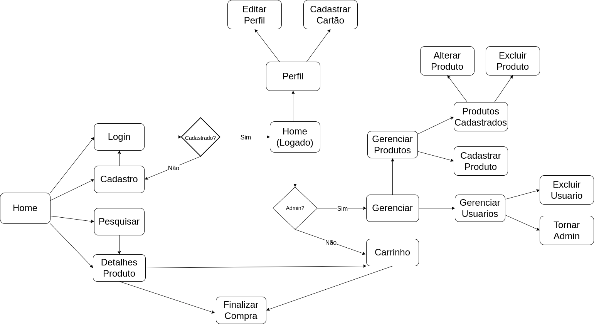

# Retro Archive Store

- Retro Archive Store
  - [Sobre](#sobre)
  - [Requisitos](#requisitos)
  - [Descrição](#descrição)
  - [Comentários Sobre o Código](#comentários-sobre-o-código)
  - [Plano de Teste](#plano-de-teste)
  - [Resultados do Teste](#resultados-do-teste)
  - [Procedimentos de Build](#procedimentos-de-build)
  - [Problemas](#problemas)
  - [Comentários](#comentários)
  - [Integrantes](#integrantes)

## Sobre

Repositório para projeto da disciplina Introdução ao Desenvolvimento Web - ICMC USP

## Requisitos

O site consiste de dois tipos de usuários:  **administradores** e **clientes**.

Os **administradores**, constítuidos de _id_, _phone_, _name_, _email_, _username_, _password_ são responsáveis por:
* Registrar e gerenciar administradores, clientes e produtos do sistema;
* A aplicação já vem com uma conta administradora cujo usuário e senha são _admin_ e _admin_.

Os **clientes**, constituídos de _id_, _phone_, _photo_, _address_, _name_, _email_, _username_, _password_ e _xptotal_, são usuários que tem acesso ao sistema para comprar produtos.
Os **produtos (jogos)** são constituídos de _name_, _id_, _photo_, _platform_, _genres_, _description_, _price_, _quantity stock_ e _quantity sold_, os clientes podem.

A loja vende **jogos retrôs**.

Venda de produtos: Produtos são selecionados, sua quantidade escolhida e são incluídos no carrinho. Produtos são comprado usando um número de cartão de crédito (qualquer número é aceito pelo sistema). A quantidade do produto vendido é subtraída do estoque e adicionada na quantidade vendida. Carrinhos são esvaziados apenas ao pagar ou pelo cliente.

As funcionalidades são:

* Login com email e senha na plataforma e cadastro.
* Ver perfil do cliente e alterar dados cadastrais.
* Visualização da página de administração, com a possibilidade de administrar produtos, clientes e administradores da loja.
* Acesso à homepage, com visualização de alguns produtos selecionados pela loja.
* Visualização de um produto, com nome, descrição, preço e botão para adicionar ao carrinho.
* Acessar o carrinho de compras, alterar a quantidade de itens, conferir o preço total e finalizar a compra.
* Opção de salvar informações do cartão de crédito para efetuar o pagamento.
* Opção de alterar o endereço de entrega, email, telefone e username.
* Sistema de nível e experiência no perfil de usuário, que ganhará títulos e aumentará sua experiência conforme compra.
* Filtros: filtros podem ser aplicados aos produtos pelos clientes. Os filtros possíveis são por _name_, _plataform, _genres_, _price_, _quantity stock_ e _quantity sold_. Por exemplo, um cliente pode definir um filtro que mostra apenas os jogos cuja plataforma é o Playstation 2;

## Descrição
Projeto foi feito usando React, para a conta de administrador, cadastrar conta com email: admin@admin.com e senha: admin.
## Diagrama de Navegação

## Comentários Sobre o Código

## Plano de Teste

Os testes foram feitos manualmente.

## Resultados do Teste

Sistema age conforme o esperado.

## Procedimentos de Build
Rodar npm install dentro da pasta milestone_3 e npm install dentro da pasta front, após isso é necessário rodar um npm start tanto na milestone_3 quanto dentro da front. Colocar em uma .env CONN_STR=<string de conexao do mongodb>, e depois rodar npm start tanto na pasta milestone_3 quanto dentro do front. Precisa ter NodeJS instalado e npm também. 

## Problemas

## Comentários
Sem comentários dessa vez.

## Integrantes

| Nome                       | NUSP |
|----------------------------|------|
| Gabriel Barbosa de Oliveira | 12543415 |
| Gustavo Bhering Grande | 12542780 |
| Rafael de Almeida | 11872028 |
